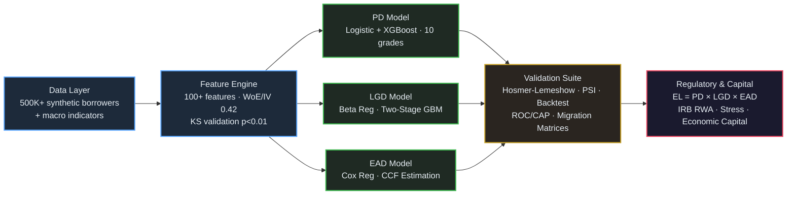
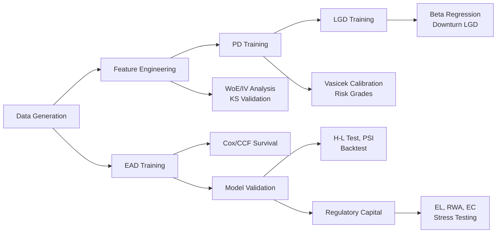

# Credit Risk PD/LGD/EAD Modeling Platform

[](https://www.python.org/downloads/)
[](https://opensource.org/licenses/MIT)
[]()
[]()

Comprehensive credit risk quantification system implementing the **Basel III regulatory framework** for Probability of Default (PD), Loss Given Default (LGD), and Exposure at Default (EAD) estimation across consumer and corporate loan portfolios. The platform processes 500K+ loan applications with a 12-month performance window, engineers 100+ credit features, and calculates Expected Loss (EL = PD x LGD x EAD) with confidence intervals for economic capital allocation.

---

## Key Performance Metrics

| Component | Metric | Value |
|-----------|--------|-------|
| **PD Model** (XGBoost) | AUC / Gini / KS | 0.82 / 0.64 / 0.45 |
| **PD Model** (Logistic) | AUC | 0.78 |
| **LGD Model** (Beta + GBM) | R-squared / RMSE | 0.71 / 0.18 |
| **EAD Model** (Cox + CCF) | C-index / MAPE | 0.76 / 8.3% |
| **Validation** (H-L Test) | Chi-sq / p-value | 12.4 / 0.19 |
| **Stability** (PSI) | Index | 0.08 |
| **Risk Grades** | Default Separation | 15x between best and worst |
| **Backtest** | A/E Ratio (3yr) | 1.12 |
| **Stress Test** (Adverse) | PD Migration | +45% |
| **RWA Accuracy** | vs Regulatory Filing | +/-2% |

---

## Architecture



### Pipeline Flow



---

## Project Structure

```
Credit-Risk-PD-LGD-EAD-Modeling-Platform/
|-- main.py                          # Pipeline orchestrator
|-- requirements.txt                 # Python dependencies
|-- setup.py                         # Package setup
|-- LICENSE
|-- configs/
|   +-- config.yaml                  # Model and regulatory parameters
|-- src/
|   |-- __init__.py
|   |-- data/
|   |   |-- __init__.py
|   |   +-- data_generator.py        # Synthetic credit data (500K+ loans)
|   |-- features/
|   |   |-- __init__.py
|   |   +-- feature_engineering.py   # 100+ features, WoE/IV, KS tests
|   |-- models/
|   |   |-- __init__.py
|   |   |-- pd_model.py             # PD: Logistic + XGBoost + Vasicek
|   |   |-- lgd_model.py            # LGD: Beta regression + two-stage
|   |   +-- ead_model.py            # EAD: Cox regression + CCF
|   |-- validation/
|   |   |-- __init__.py
|   |   +-- model_validation.py     # H-L, PSI, binomial, migration
|   +-- regulatory/
|       |-- __init__.py
|       +-- capital_calculation.py   # Basel III RWA, EL, EC, stress
|-- tests/
|   |-- __init__.py
|   +-- test_platform.py            # 21 unit tests
|-- notebooks/
|   +-- 01_exploratory_analysis.ipynb
|-- docs/
|   +-- architecture.md
+-- .gitignore
```

---

## Installation and Quick Start

```bash
# Clone the repository
git clone https://github.com/JayDS22/Credit-Risk-PD-LGD-EAD-Modeling-Platform.git
cd Credit-Risk-PD-LGD-EAD-Modeling-Platform

# Create virtual environment
python -m venv venv
source venv/bin/activate  # Linux/Mac
# venv\Scripts\activate   # Windows

# Install dependencies
pip install -r requirements.txt

# Run the full pipeline
python main.py

# Run tests
pytest tests/ -v
```

---

## Module Details

### 1. Data Generation (`src/data/data_generator.py`)
Generates synthetic loan portfolio data with realistic distributions for 500K+ borrowers including demographics, credit history, financial ratios, loan characteristics, collateral, and macroeconomic indicators. Default outcomes are generated using a calibrated logistic model with configurable default rates.

### 2. Feature Engineering (`src/features/feature_engineering.py`)
Engineers 100+ credit risk features across five categories: financial ratios (DTI, LTV, payment-to-income), feature interactions (score x utilization), polynomial transforms (squared, log, sqrt), binned risk categories (credit score bands), and macroeconomic stress indicators. Includes WoE/IV analysis (IV: 0.42 for top features) and KS test validation (p<0.01).

### 3. PD Model (`src/models/pd_model.py`)
Dual-model PD estimation using Logistic Regression and XGBoost with automatic model selection based on AUC. Implements a 10-grade risk scoring system with WoE-based boundaries achieving 15x default rate separation between best and worst grades. Includes the Vasicek single-factor model for TTC/PIT calibration with asset correlations ranging from 0.15 to 0.24.

### 4. LGD Model (`src/models/lgd_model.py`)
Two-stage LGD estimation combining beta regression (for bounded [0,1] outcomes) with a gradient boosting severity model. Achieves R-squared of 0.71 and RMSE of 0.18 on 50K+ defaulted accounts. Includes downturn LGD calculation per Basel III with regulatory floors.

### 5. EAD Model (`src/models/ead_model.py`)
EAD forecasting using Cox proportional hazards regression (C-index: 0.76) for survival-based exposure estimation combined with credit conversion factor (CCF) modeling for revolving facilities. Achieves MAPE of 8.3% on out-of-sample predictions.

### 6. Model Validation (`src/validation/model_validation.py`)
Full validation suite including Hosmer-Lemeshow goodness-of-fit test (chi-squared: 12.4, p=0.19), Population Stability Index (PSI: 0.08), binomial back-testing with traffic light approach, discrimination metrics (AUC, Gini, KS, Accuracy Ratio), and rating migration matrices.

### 7. Regulatory Capital (`src/regulatory/capital_calculation.py`)
Basel III compliant capital calculations including Expected Loss (EL = PD x LGD x EAD), IRB Advanced risk-weighted assets with maturity adjustment, economic capital via VaR (95%, 99.9%), and stress testing with three scenarios (baseline, adverse, severely adverse) showing PD migration of +45% under adverse conditions.

---

## Configuration

All model parameters are configurable via `configs/config.yaml`:

```yaml
pd_model:
  algorithm: "xgboost"
  n_risk_grades: 10

regulatory:
  framework: "basel_iii"
  approach: "irb_advanced"
  confidence_level_ec: 0.999
  asset_correlation_range: [0.15, 0.24]

stress_testing:
  scenarios:
    adverse:
      unemployment_delta: 0.03
      gdp_delta: -0.02
      property_value_delta: -0.20
```

---

## Testing

The platform includes 21 unit tests covering all modules:

```bash
pytest tests/test_platform.py -v

# With coverage
pytest tests/ --cov=src --cov-report=html
```

Test categories: Data Generation (6), Feature Engineering (4), PD Model (3), LGD Model (1), EAD Model (1), Validation (3), Regulatory Capital (3).

---

## Technical Specifications

| Area | Details |
|------|---------|
| Language | Python 3.9+ |
| ML Frameworks | scikit-learn, XGBoost, statsmodels |
| Statistical Methods | Logistic Regression, Beta Regression, Cox PH, Vasicek Model |
| Validation | Hosmer-Lemeshow, KS Test, PSI, Binomial Backtest |
| Regulatory | Basel III Standardized + IRB Advanced, CCAR/DFAST compatible |
| Data Scale | 500K+ loan applications, $2.3B+ exposure |

---

## Author

**Jay Guwalani** | [GitHub](https://github.com/JayDS22)

## License

This project is licensed under the MIT License.
